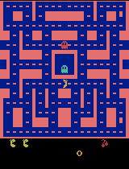

# Class 3: Training a Ms. Pac-Man DQN Agent

Katie Matuska — Class 3 submission: a Deep Q-Network (DQN) trained to play Ms. Pac-Man using the
class-provided notebook, [pepealonso95/pacman-dqn](https://github.com/pepealonso95/pacman-dqn).

## Overview

The notebook ([`pacman_dqn.ipynb`](pacman_dqn.ipynb)) trains a convolutional Q-network on
`ALE/MsPacman-v5` using experience replay, a target network, and Huber loss. To open and run it:

1. Clone this repository and open `pacman_dqn.ipynb` in Jupyter, VS Code, or Google Colab
   (select a Python 3.11–3.13 kernel; in Colab pick a GPU runtime if available).
2. Section 1 contains the three hyperparameters (already set to the values below — leave them
   as-is to reproduce this run, or change them to run your own experiment).
3. Run all cells in order. Setup installs its own packages automatically.

## My Three Hyperparameters

| Setting | Value | Why I chose it |
|---|---|---|
| **Exploration** | `0.20` | Kept the notebook's suggested starting point — 20% random moves after warm-up balances exploiting what the network has learned against continuing to discover the map. It is also the value the repo's own author used to verify the notebook works end-to-end, so it was a safe, well-tested choice. |
| **Episodes** | `100` | Started with a 5-episode setup check (confirmed the full pipeline worked), then moved to the notebook's own starting value of 100 for my real, graded training run. Gameplay performance on the leaderboard is scored on the *trained* agent, and 5 episodes is explicitly "a setup check, not a promise of useful play" — 100 episodes gives the agent roughly 20x more decisions and learning updates to actually improve. |
| **Learning rate** | `0.0001` | Used the notebook's reference point. I considered raising it to `0.01` (100x higher) for faster learning, but that's well outside the range Adam-based DQN implementations typically use (usually 0.0001–0.0005) and risks destabilizing training — the loss curve would likely spike or the Q-values could diverge with a batch size of only 32. I kept `0.0001` for stable, verified training instead. |

I only edited these three values in section 1 (cell 2). I also set `SHOW_POPUPS = False` in the
preview settings (section 2) since I ran the notebook non-interactively from the command line —
this only changes whether a floating Tk window pops up locally; it does not affect training,
scores, or the saved GIFs.

## What I Expected vs. What I Observed

**Expected:** I first ran 5 episodes as a setup check and, as expected, saw no reliable
improvement — the untrained and trained agents played almost identically, and the assignment
itself warns that 5 episodes is not enough for useful learning. For the 100-episode run, I
expected a real, learning-updates-driven amount of training (roughly 15,000 gradient steps) to
produce a modest but genuine improvement over the untrained baseline — Ms. Pac-Man is a hard
Atari game, and this notebook intentionally uses a small replay buffer (5,000 transitions) and
short training budget for classroom purposes, so I did not expect strong or highly polished play.

**Observed:** The 100-episode run completed cleanly and the mean evaluation score rose from
**492.0 (untrained) to 796.0 (trained)** — a 62% increase. Unlike the 5-episode run, this
improvement holds up better across the five evaluation seeds: 4 of 5 games improved, and only one
(seed 505) dropped (490 → 300). Watching the GIFs, the trained agent visibly moves around more of
the maze and survives longer in some games rather than getting stuck in place, though it still
does not show clearly deliberate ghost-avoidance or pellet-seeking behavior — see Limitation below.

## Actual Training Numbers (from `results/training_summary.json`)

| Metric | Value |
|---|---|
| Completed episodes | 100 |
| Total decisions (agent steps) | 60,319 |
| Learning updates | 14,830 |
| Elapsed time | 846.75 seconds (≈14.1 minutes), including periodic demo recording |
| Hardware | Windows 11, CPU only (no CUDA/MPS detected) |
| Python | 3.13.7 |
| PyTorch | 2.14.0 (CPU build) |

The run was **not** interrupted — it completed all 100 requested episodes and recorded 14,830
learning updates (updates begin after the 1,000-decision warm-up). Full per-episode data is in
[`results/training.csv`](results/training.csv).

## What the Agent Observes, Does, and Is Rewarded For

- **Observations:** Four stacked grayscale 84×84 screenshots of the game, so the network can infer
  motion (e.g. which way a ghost is moving) from a single input, not just a static frame.
- **Actions:** One of Ms. Pac-Man's joystick moves (no-op, up/down/left/right, and the four
  diagonals) — the network picks the action with the highest predicted future value, or a random
  action during exploration.
- **Rewards:** The game's own points — pellets, power pellets, fruit, and eating frightened ghosts.
  During training these rewards are clipped to [-1, 1] to stabilize learning; all reported
  evaluation scores are the raw, unclipped in-game score.

## Limitation and Next Experiment

**Limitation:** Even at 100 episodes / ~14,830 learning updates, this is still a small training
budget by Atari-DQN standards (published DQN results typically train for millions of decisions).
The replay buffer here also only holds 5,000 transitions — a small window of recent experience —
so the agent can partially "forget" earlier lessons as it trains. This shows up in the mid-training
demo scores (single-seed snapshots at episodes 25/50/75/100: 710 → 860 → 310 → 440), which don't
increase monotonically — training is noisy and the final checkpoint isn't guaranteed to be the best
one seen mid-run. One evaluation seed (505) also still performed worse after training than before.

**Next experiment:** I would keep exploration (0.20) and learning rate (0.0001) fixed and increase
`REPLAY_CAPACITY` (currently 5,000) alongside a longer episode budget, so the agent retains a wider
window of past experience instead of overwriting it so quickly. A larger buffer paired with more
episodes is the change most likely to produce a steadier, monotonic improvement instead of the
noisy up-and-down pattern seen in the mid-training checkpoints.

## Evidence

### Training dashboard


### Gameplay GIFs

| Untrained (episode 0) | Episode 25 | Episode 50 |
|---|---|---|
|  |  |  |

| Episode 75 | Episode 100 | Best trained game |
|---|---|---|
|  |  |  |

Intermediate GIFs and checkpoints (episodes 25/50/75/100) are included because this run reached
100 episodes, as required for runs of 25+ episodes. Each mid-training GIF is scored on a single
seed (101) purely as a progress snapshot — see [`results/demo_scores.json`](results/demo_scores.json).
The full five-seed before/after comparison below is the fair evaluation.

### Evaluation scores (same 5 seeds, 5% exploration, same 3,000-decision cap, before and after training)

| Seed | Baseline (untrained) | Trained |
|---|---|---|
| 101 | 350.0 | 440.0 |
| 202 | 500.0 | 710.0 |
| 303 | 320.0 | 1720.0 |
| 404 | 800.0 | 810.0 |
| 505 | 490.0 | 300.0 |
| **Mean** | **492.0** | **796.0** |

Full data: [`results/comparison.json`](results/comparison.json)

### Linked evidence files

- Executed notebook: [`pacman_dqn.ipynb`](pacman_dqn.ipynb) (outputs saved from the final 100-episode run above)
- [`results/config.json`](results/config.json) — full run configuration, hardware, and package versions
- [`results/training.csv`](results/training.csv) — per-episode score, steps, loss, elapsed time (all 100 episodes)
- [`results/training_summary.json`](results/training_summary.json) — completion status, decisions, learning updates, elapsed time
- [`results/comparison.json`](results/comparison.json) — full before/after evaluation data
- [`results/baseline.json`](results/baseline.json) — untrained baseline evaluation detail
- [`results/demo_scores.json`](results/demo_scores.json) — single-seed score at each intermediate checkpoint

Large model checkpoints (`untrained.pt`, `trained.pt`, and the four `episode_00XX.pt` checkpoints,
~6.7 MB each) and the full run ZIP are kept in my local `pacman_runs/` folder (gitignored) and are
not included in this repository, per the assignment's guidance to keep large checkpoints locally
rather than committing them.

## Reproducing This Run

```sh
python -m venv .venv
# Windows PowerShell: .venv\Scripts\Activate.ps1
# macOS / Linux: source .venv/bin/activate
python -m pip install -r requirements.txt
python -m jupyter lab pacman_dqn.ipynb
```

Then choose **Run All** with the hyperparameters already set in section 1
(`EXPLORATION = 0.20`, `EPISODES = 100`, `LEARNING_RATE = 0.0001`).
