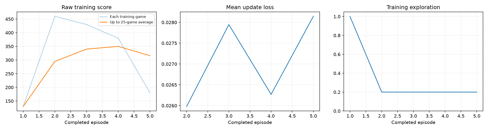
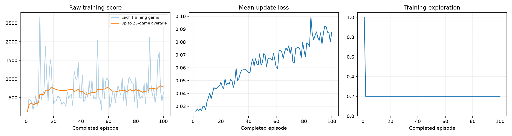
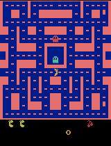
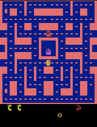

# Class 3: Training a Ms. Pac-Man DQN Agent

Katie Matuska — Class 3 submission: a Deep Q-Network (DQN) trained to play Ms. Pac-Man using the
class-provided notebook, [pepealonso95/pacman-dqn](https://github.com/pepealonso95/pacman-dqn).

## Overview

The notebook ([`pacman_dqn.ipynb`](pacman_dqn.ipynb)) trains a convolutional Q-network on
`ALE/MsPacman-v5` using experience replay, a target network, and Huber loss. To open and run it:

1. Clone this repository and open `pacman_dqn.ipynb` in Jupyter, VS Code, or Google Colab
   (select a Python 3.11–3.13 kernel; in Colab pick a GPU runtime if available).
2. Section 1 contains the three hyperparameters (currently set to the 100-episode run below. Leave them as-is to reproduce it, or change them to run your own experiment).
3. Run all cells in order. Setup installs its own packages automatically.

I ran the notebook **twice** with the same exploration and learning rate, changing only the
episode budget, so I could compare a short setup-check run against a full training run.

## My Three Hyperparameters

| Setting | Value | Why I chose it |
|---|---|---|
| **Exploration** | `0.20` | Kept the notebook's suggested starting point — 20% random moves after warm-up balances exploiting what the network has learned against continuing to discover the map. It is also the value the repo's own author used to verify the notebook works end-to-end, so it was a safe, well-tested choice. Held constant across both runs. |
| **Episodes** | `5`, then `100` | First ran `5` as a setup check, exactly as the assignment recommends, to confirm the full pipeline (install → baseline eval → training → final eval → GIFs → plot → ZIP) worked on my machine (CPU-only, no CUDA/MPS). Then ran `100` — the notebook's own starting value — to observe the impact of collecting more training data. |
| **Learning rate** | `0.0001` | Used the notebook's reference point in both runs. I considered raising it to `0.01` (100x higher) for faster learning, but that's well outside the range Adam-based DQN implementations typically use (usually 0.0001–0.0005) and risks destabilizing training — the loss curve would likely spike or the Q-values could diverge with a batch size of only 32. I kept `0.0001` for stable, verified training instead. |

I only edited these three values in section 1 (cell 2) between runs. I also set
`SHOW_POPUPS = False` in the preview settings (section 2) since I ran the notebook
non-interactively from the command line — this only changes whether a floating Tk window pops up
locally; it does not affect training, scores, or the saved GIFs.

## What I Expected vs. What I Observed

**Expected:** For the 5-episode run, I expected no reliable improvement — the assignment itself
warns that 5 episodes is not enough for useful learning, and with so little data I expected the
"before" and "after" agents to look and score about the same. For the 100-episode run, I expected
a real, learning-updates-driven amount of training ( ~20x more than
the 5-episode run) to produce a modest but genuine improvement.

**Observed:** This is exactly the pattern I saw. The 5-episode run's mean score did rise (492.0 →
730.0), but that was driven almost entirely by one outlier game (seed 303: 320 → 1640) while
another game got worse (seed 202: 500 → 240) — with only 388 learning updates I read that as noise,
not learning, and the gameplay GIFs for that run look nearly identical before and after. The
100-episode run showed a steadier improvement (492.0 → 796.0): 4 of 5 evaluation seeds improved,
not just one outlier, and the trained agent visibly moves around more of the maze in the GIFs
rather than getting stuck in place — see the side-by-side comparison below.

## Run Comparison: 5 Episodes vs. 100 Episodes

Both runs used the same exploration (0.20) and learning rate (0.0001), same 5 evaluation seeds,
same 5% evaluation exploration, and same 3,000-decision cap. Only `EPISODES` changed.

| Metric | Run 1: 5 episodes | Run 2: 100 episodes |
|---|---|---|
| Completed episodes | 5 | 100 |
| Total decisions (agent steps) | 2,550 | 60,319 |
| Learning updates | 388 | 14,830 |
| Elapsed time | 18.96 seconds | 846.75 seconds (≈14.1 min) |
| Baseline (untrained) mean score | 492.0 | 492.0 |
| Trained mean score | 730.0 | **796.0** |
| Mean score change | +238.0 (+48%) | **+304.0 (+62%)** |
| Seeds that improved | 3 of 5 | **4 of 5** |
| Hardware | Windows 11, CPU only (no CUDA/MPS) | Windows 11, CPU only (no CUDA/MPS) |

Both runs started from the exact same untrained baseline (492.0 mean, same 5 seeds), since the
baseline network is freshly initialized with the same fixed `SEED = 42` each time. The 100-episode
run's higher mean score, and the fact that improvement was spread across more seeds instead of one
outlier, is what makes me trust it as a real (if still modest) learning signal rather than
evaluation noise — see the per-seed breakdown below.

### Per-seed evaluation scores

| Seed | Untrained baseline | Run 1 trained (5 ep) | Run 2 trained (100 ep) |
|---|---|---|---|
| 101 | 350.0 | 440.0 | 440.0 |
| 202 | 500.0 | 240.0 | 710.0 |
| 303 | 320.0 | 1640.0 | 1720.0 |
| 404 | 800.0 | 440.0 | 810.0 |
| 505 | 490.0 | 890.0 | 300.0 |
| **Mean** | **492.0** | **730.0** | **796.0** |

Run 1 data: [`results/run_5_episodes/comparison.json`](results/run_5_episodes/comparison.json)
Run 2 data: [`results/run_100_episodes/comparison.json`](results/run_100_episodes/comparison.json)

**My final, graded submission is Run 2 (100 episodes)** — it's the version left active in
`pacman_dqn.ipynb` and referenced by the leaderboard.

## What the Agent Observes, Does, and Is Rewarded For

- **Observations:** Four stacked grayscale 84×84 screenshots of the game, so the network can infer
  motion (e.g. which way a ghost is moving) from a single input, not just a static frame.
- **Actions:** One of Ms. Pac-Man's joystick moves (no-op, up/down/left/right, and the four
  diagonals) — the network picks the action with the highest predicted future value, or a random
  action during exploration.
- **Rewards:** The game's own points — pellets, power pellets, fruit, and eating frightened ghosts.
  During training these rewards are clipped to [-1, 1] to stabilize learning; all reported
  evaluation scores are the raw, unclipped in-game score.

## Limitation and Next Experiment

**Limitation:** Even at 100 episodes / ~14,830 learning updates, this is still a small training
budget by Atari-DQN standards (published DQN results typically train for millions of decisions).
The replay buffer here also only holds 5,000 transitions — a small window of recent experience —
so the agent can partially "forget" earlier lessons as it trains. This shows up in the mid-training
demo scores for Run 2 (single-seed snapshots at episodes 25/50/75/100: 710 → 860 → 310 → 440),
which don't increase monotonically — training is noisy and the final checkpoint isn't guaranteed
to be the best one seen mid-run. One evaluation seed (505) also still performed worse after
training than before in Run 2, and Run 1's "improvement" was mostly a single-seed outlier — both
are signs that 5 seeds and this training budget still leave a lot of evaluation noise.

**Next experiment:** I would keep exploration (0.20) and learning rate (0.0001) fixed and increase
`REPLAY_CAPACITY` (currently 5,000) alongside a longer episode budget (e.g. 200–300), so the agent
retains a wider window of past experience instead of overwriting it so quickly. A larger buffer
paired with more episodes is the change most likely to produce a steadier, monotonic improvement
instead of the noisy up-and-down pattern seen in the mid-training checkpoints, and would also
shrink the gap between the two runs' outlier-driven vs. broad-based score gains.

## Evidence

### Training dashboards

| Run 1: 5 episodes | Run 2: 100 episodes |
|---|---|
|  |  |

### Gameplay GIFs — Run 2 (100 episodes, final submission)

| Untrained (episode 0) | Episode 25 | Episode 50 |
|---|---|---|
|  |  |  |

| Episode 75 | Episode 100 | Best trained game |
|---|---|---|
|  |  |  |

Intermediate GIFs and checkpoints (episodes 25/50/75/100) are included for Run 2 because it
reached 100 episodes, as required for runs of 25+ episodes. Each mid-training GIF is scored on a
single seed (101) purely as a progress snapshot — see
[`results/run_100_episodes/demo_scores.json`](results/run_100_episodes/demo_scores.json). The
full five-seed before/after comparison above is the fair evaluation.

### Gameplay GIFs — Run 1 (5 episodes, setup check)

| Untrained (episode 0) | Best trained game |
|---|---|
|  |  |

Run 1 stayed under the 25-episode threshold, so no intermediate GIFs or checkpoints were generated
for it, per the assignment instructions.

### Linked evidence files

**Run 2 — 100 episodes (final submission):**
- Executed notebook: [`pacman_dqn.ipynb`](pacman_dqn.ipynb) (outputs saved from this run)
- [`results/run_100_episodes/config.json`](results/run_100_episodes/config.json) — full run configuration, hardware, and package versions
- [`results/run_100_episodes/training.csv`](results/run_100_episodes/training.csv) — per-episode score, steps, loss, elapsed time (all 100 episodes)
- [`results/run_100_episodes/training_summary.json`](results/run_100_episodes/training_summary.json) — completion status, decisions, learning updates, elapsed time
- [`results/run_100_episodes/comparison.json`](results/run_100_episodes/comparison.json) — full before/after evaluation data
- [`results/run_100_episodes/baseline.json`](results/run_100_episodes/baseline.json) — untrained baseline evaluation detail
- [`results/run_100_episodes/demo_scores.json`](results/run_100_episodes/demo_scores.json) — single-seed score at each intermediate checkpoint

**Run 1 — 5 episodes (setup check, for comparison):**
- [`results/run_5_episodes/config.json`](results/run_5_episodes/config.json)
- [`results/run_5_episodes/training.csv`](results/run_5_episodes/training.csv)
- [`results/run_5_episodes/training_summary.json`](results/run_5_episodes/training_summary.json)
- [`results/run_5_episodes/comparison.json`](results/run_5_episodes/comparison.json)
- [`results/run_5_episodes/baseline.json`](results/run_5_episodes/baseline.json)

Large model checkpoints (`untrained.pt`, `trained.pt`, and Run 2's four `episode_00XX.pt`
checkpoints, ~6.7 MB each) and the full run ZIPs are kept in my local `pacman_runs/` folder
(gitignored) and are not included in this repository, per the assignment's guidance to keep large
checkpoints locally rather than committing them.

## Reproducing These Runs

```sh
python -m venv .venv
# Windows PowerShell: .venv\Scripts\Activate.ps1
# macOS / Linux: source .venv/bin/activate
python -m pip install -r requirements.txt
python -m jupyter lab pacman_dqn.ipynb
```

Section 1 is currently set to `EXPLORATION = 0.20`, `EPISODES = 100`, `LEARNING_RATE = 0.0001`
(Run 2). To reproduce Run 1, change `EPISODES` to `5` and choose **Run All**.
